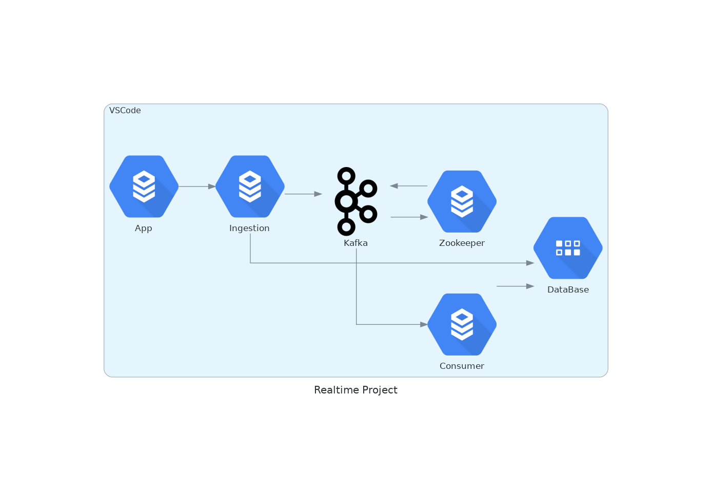
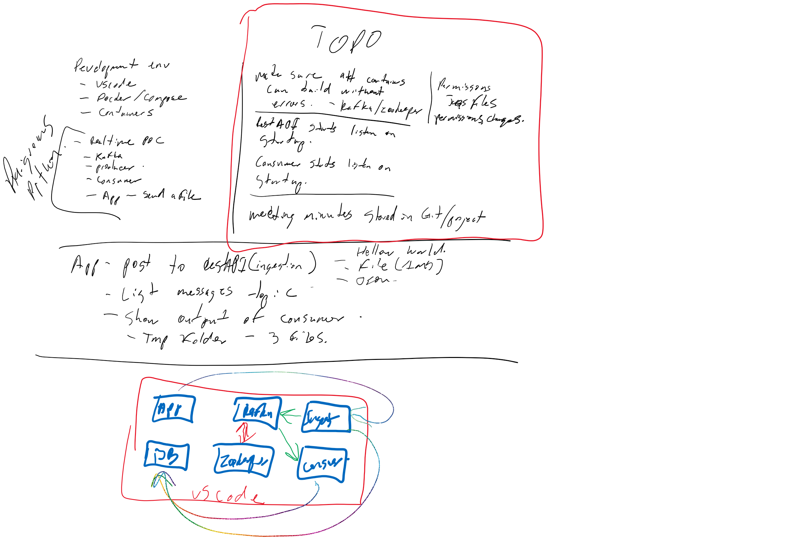

# Project Overview
    * A Realtime project for processing data
    * Standardized on a development environment
    * Full Transparency

# Project Accomplishments
    * Runs realtime
    * Modules that have no dependencies
    * Good documentation
    * A self contained project

# Project Diagrams

# Project Meeting Minutes
| 2021-07    | 2021-08    | 2021-09    |
| :--------: | :--------: | :--------: |
|[2021-07-13](src/docs/sessions/202107/20210713-mom.md) | [2021-08-03](src/docs/sessions/202108/20210803-mom.md) | --- |
|[2021-07-14](src/docs/sessions/202107/20210714-mom.md) | [2021-08-04](src/docs/sessions/202108/20210804-mom.md) | --- |
|[2021-07-22](src/docs/sessions/202107/20210722-mom.md) | [2021-08-05](src/docs/sessions/202108/20210805-mom.md) | --- |
|[2021-07-29](src/docs/sessions/202107/20210729-mom.md) | [2021-08-06](src/docs/sessions/202108/20210806-mom.md) | --- |
|[2021-07-30](src/docs/sessions/202107/20210730-mom.md) | [2021-08-11](src/docs/sessions/202108/20210807-mom.md) | --- |
| --- | [2021-08-17](src/docs/sessions/202108/20210808-mom.md) | --- |
| --- | [2021-08-18](src/docs/sessions/202108/20210818-mom.md) | --- |
| --- | [2021-08-19](src/docs/sessions/202108/20210819-mom.md) | --- |
| --- | [2021-08-23](src/docs/sessions/202108/20210823-mom.md) | --- |

# Future Works
    * Larger Messages
    * Chunking files
    * Kubernetes

# What I Learned
    * Fast paced environment
    * New software
    * Invaluable experience