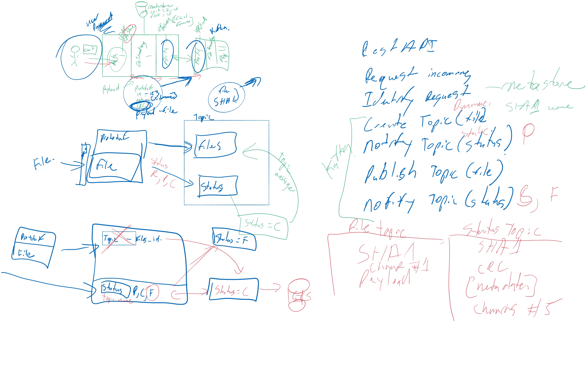

# Activities
## Rashmi
* working on Protobuf publishing to topic (still pending)
* Gradle setup complete using 2.x
* Upgrading Gradle to 7.x (inprogress)

## Farid
* Use Data.org (sp) to get sample data for processing (inprogress)
* Setting up ACLs Client side (user/password) (inprogress)

## Varun
* Setting up ACLs Server side (user/password)
* Changing permission on the fly for topics (DONE)
* __NOTE: Users/Passwords must be defined at startup__
* Working on getting server connections inside VSCode container (in progress)
* Using CA certs with Kafka (Milestone 2)

## Farid/Varun
* Publishing raw data file to Kafka (Milestone 1)
* Publishing protobuf(raw data file) to Kafka (Milestone 2)
* Publishing protobuf(raw data file) in chunks(@x Mb) to Kafka (Milestone 3)

## Krushna (+Dallin)
* Building a metadata, design and requirments (still pending)
* Prototype (still pending)

## Krushna
* Metastore key/store design

## Dallin
* Create a metastore container for RESTAPI

# Images
## Highlevel ingestion message publishing

