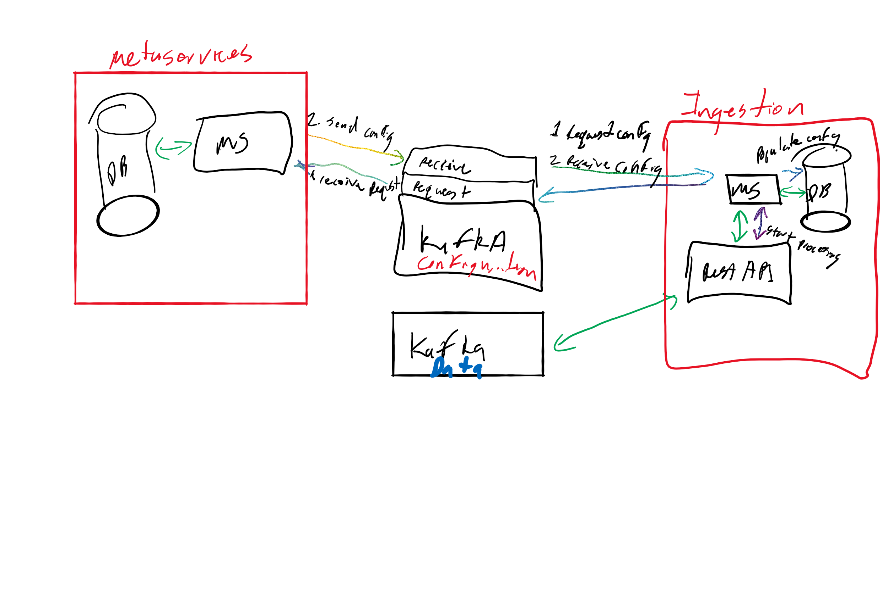

# Activities
## Rashmi
* working on Protobuf publishing to topic (still pending)

## Farid
* Upgrading Gradle to 7.x (inprogress)
* Tested with 5MB file (DONE)
* Testing with 10MB and larger to identify limit (in progress)

## Varun
* Setting up ACLs Server side (user/password) (DONE) - Docker Configs
* __NOTE: Users/Passwords must be defined at startup__
* Working on getting server connections inside VSCode container (DONE)
* Using CA certs with Kafka (in progress)
* Testing using CA Certs AND user/password (in progress)

## Farid/Varun
* Publishing raw data file to Kafka (Done)
* Publishing protobuf(raw data file) to Kafka (Milestone 2)
* Publishing protobuf(raw data file) in chunks(@x Mb) to Kafka (Milestone 3)

## Krushna (+Dallin)
* Building a metadata, design and requirments (still pending)
* Prototype (still pending)

## Krushna
* Metastore key/store design

## Dallin
* Create a metastore container for RESTAPI
* Test KAFKA with JAAS and server properties in Docker build

# Images
## Highlevel Metastore Flow Diagram
