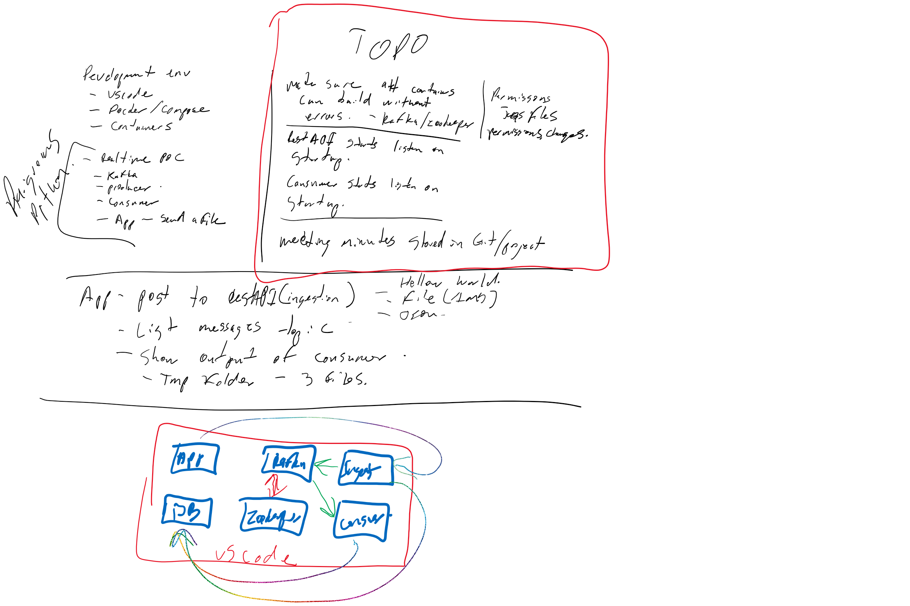

# Activities
## Rashmi
* working on Protobuf publishing to topic (still pending)
* **combine code with Farid to test Protobuf**

## Farid
* Upgrading Gradle to 7.x (inprogress)
* Tested with 5MB file (DONE)
* Testing with 10MB and larger to identify limit (DONE)
* Testing with 1GB and larger to identify limit (DONE)
* Testing with 500MB and larger split into multiple sends (stretch)
* **RestAPI Ingest working, need tp consolidate configs**
* **RestAPI Consumer (in progress)**

## Varun
* Using CA certs with Kafka (DONE)
* Testing using CA Certs AND user/password (DONE)
* **Consolidating configs for Docker build (config/local)**
* **Researching BitNami docker image ENV/Setup**

## Farid/Varun
* Publishing protobuf(raw data file) to Kafka (Milestone 2)
* Publishing protobuf(raw data file) in chunks(@x Mb) to Kafka (Milestone 3)

## Krushna (+Dallin)
* Building a metadata, design and requirments (still pending)
* Prototype (still pending)

## Krushna
* Metastore key/store design

## Dallin
* Create a metastore container for RESTAPI (in progress)
* Test KAFKA with JAAS and server properties in Docker build (in progress)

# Images
## Highlevel Demo day Ideas
